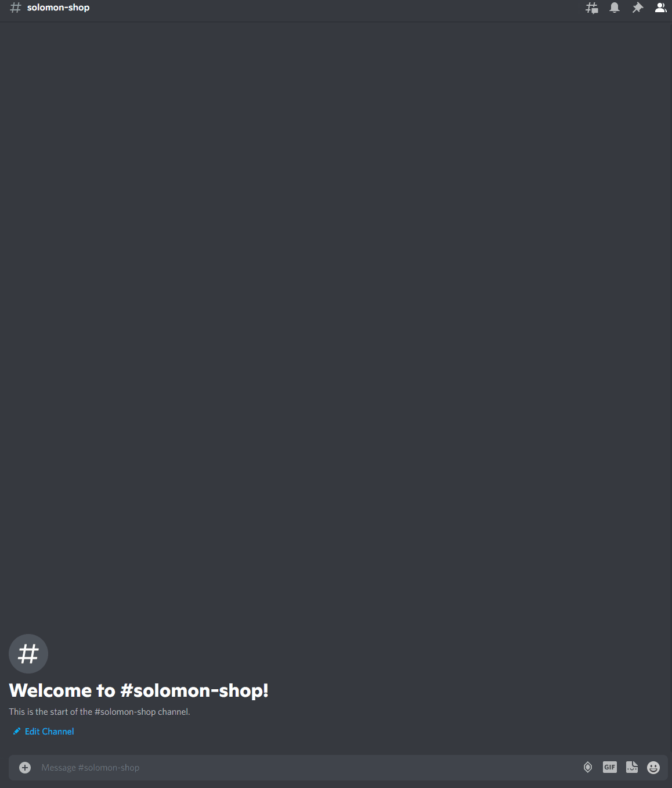

# solomon-shop-bot

My personal discord bot to automatically detect Yu-Gi-Oh! OCG card and add in google sheet.



## For development

### Setup development environment

```sh
virtualenv venv
# For fish
source venv/bin/activate.fish
# For shell
source venv/bin/activate
pip install -r requirements.txt
```

### Environment variables

```env
# .env
DISCORD_TOKEN=<TOKEN>
SOLOMON_API_ENDPOINT=https://solomon.pks.sh
SOLOMON_VISION_API_ENDPOINT=https://solomon-vision.pks.sh
ELASTICSEARCH_ENDPOINT=<ELASTICSEARCH_ENDPOINT>
BIGWEB_ICON=https://bigweb.co.jp/inc/space2.gif
YUYUTEI_ICON=https://yuyu-tei.jp/img/ogp.jpg
BOT_ID=<DISCORD_BOT_ID>
SPREADSHEET_ID=<GOOGLE_SPREADSHEET_ID>
SIMILARITY_THRESHOLD=0.5
```

### Running on local

```sh
# Run on machine
python src/main.py

# Run on docker
earthly +compose-up
earthly +compose-down
```

### Release

```sh
earthly --build-arg TAG=<TAG> --push +release
```
